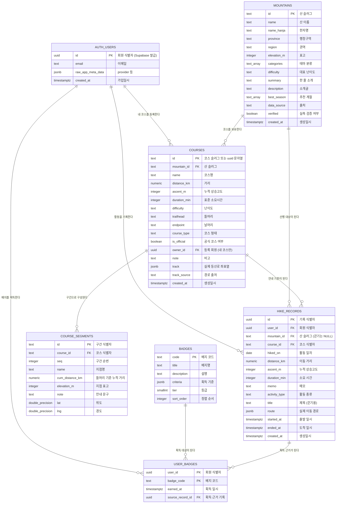

# Climb My Own — 데이터베이스 설계서

> 이 문서는 **실제로 구현되어 동작 중인 스키마**를 그대로 기술한다.
> 원천 파일은 `supabase/migrations/0001_schema.sql`, `0002_rls.sql` 이며,
> 이 문서와 SQL이 어긋나면 **SQL이 정답**이다.

| 항목 | 값 |
|---|---|
| 문서명 | Climb My Own 데이터베이스 설계서 |
| 대상 시스템 | 한국 100대 명산 코스 안내 및 산행·걷기 기록 관리 PWA |
| DBMS | PostgreSQL 15 (Supabase 관리형) |
| 스키마 | `public` (+ Supabase 내장 `auth`) |
| 테이블 수 | 6 (+ 참조용 `auth.users`) |
| 접근 제어 | Row Level Security (RLS) |
| 작성일 | 2026-08-07 |

---

## 목차

1. [문서 개요](#1-문서-개요)
2. [설계 방침](#2-설계-방침)
3. [전체 관계도 (ERD)](#3-전체-관계도-erd)
4. [테이블 정의서](#4-테이블-정의서)
   - 4.1 [mountains — 산](#41-mountains--산)
   - 4.2 [courses — 코스](#42-courses--코스)
   - 4.3 [course_segments — 코스 구간](#43-course_segments--코스-구간)
   - 4.4 [hike_records — 활동 기록](#44-hike_records--활동-기록)
   - 4.5 [badges — 배지 마스터](#45-badges--배지-마스터)
   - 4.6 [user_badges — 획득 배지](#46-user_badges--획득-배지)
   - 4.7 [auth.users — 회원 (Supabase 내장)](#47-authusers--회원-supabase-내장)
5. [JSONB 컬럼 구조](#5-jsonb-컬럼-구조)
6. [테이블이 아닌 저장소](#6-테이블이-아닌-저장소)
7. [RLS 정책](#7-rls-정책)
8. [인덱스 · 제약 일람](#8-인덱스--제약-일람)
9. [코드 값 정의](#9-코드-값-정의)
10. [도메인 엔티티 ↔ DB 컬럼 매핑](#10-도메인-엔티티--db-컬럼-매핑)
11. [설계 판단의 근거와 한계](#11-설계-판단의-근거와-한계)

---

## 1. 문서 개요

**Climb My Own**은 한국 100대 명산의 등산 코스를 안내하고, 사용자의 산행·걷기 활동을
기록·집계하며, 누적 실적에 따라 배지를 부여하는 PWA다.

데이터는 성격에 따라 두 갈래로 나뉜다. 이 구분이 스키마 전체를 지배한다.

| 갈래 | 테이블 | 누가 만드나 | 누가 읽나 | id 타입 |
|---|---|---|---|---|
| **공개 콘텐츠** | `mountains`, `course_segments`, `badges` | 운영자 (시드 SQL) | 누구나 | `text` 슬러그 |
| **사용자 데이터** | `hike_records`, `user_badges` | 로그인한 본인 | 본인만 | `uuid` |
| **혼합** | `courses` | 운영자 + 사용자 | 공식=누구나 / 내 코스=본인 | `text` |

`courses`만 혼합인 이유는 [4.2](#42-courses--코스)에서 설명한다.

### 애플리케이션 계층과의 관계

앱은 포트-어댑터 구조라 저장소를 교체할 수 있다. 이 문서가 다루는 것은 그중
`data/supabase/` 어댑터가 바라보는 스키마다.

```
features/**/ui  →  *.service  →  domain/ports (인터페이스)
                                       ↑ 구현
                        data/supabase  ┤  ← 이 문서의 범위
                        data/static    ┤     (public/data/*.json)
                        data/local     ┘     (localStorage)
```

세 어댑터가 **같은 데이터 형태**를 만들어내므로, 아래 테이블 정의는
정적 JSON(`public/data/mountains.json` 등)의 구조와도 1:1로 대응한다.

---

## 2. 설계 방침

실제로 채택한 원칙과 그 이유다.

| # | 원칙 | 이유 |
|---|---|---|
| 1 | **id 타입을 둘로 나눈다** — 콘텐츠는 `text` 슬러그, 사용자 데이터는 `uuid` | 시드 데이터를 사람이 읽고 관리해야 한다. `bukhansan`이 `1`보다 diff에서 명확하다. 반면 기록 id는 사람이 읽을 일이 없고 클라이언트가 위조하면 안 되므로 DB가 발급한다 |
| 2 | **`user_id` 기본값을 `auth.uid()`로 둔다** | 클라이언트가 사용자 id를 보내지 않아도 되고, 보내더라도 RLS가 다시 검사하므로 위조 불가 |
| 3 | **좌표열은 `jsonb`, 지점은 정규화 테이블** | 코스 경로(`track`)는 수백~수천 점이고 **항상 통째로** 읽고 쓴다. 행으로 쪼개면 이득 없이 행 수만 폭증한다. 반면 구간 지점(`course_segments`)은 개별 조회·정렬 대상이라 테이블로 둔다 |
| 4 | **산행과 걷기를 한 테이블에 담는다** | 두 활동의 컬럼이 90% 겹친다. `activity_type` 하나로 구분하고, 차이는 CHECK 제약으로 강제한다 |
| 5 | **물리 삭제** | 기록 삭제는 사용자가 "지운다"고 인지한 행위다. 남겨두면 누적 집계와 배지 판정에서 매번 제외 조건이 붙는다 |
| 6 | **RLS가 유일한 방어선** | anon key는 GitHub Pages에 노출된다(설계상 정상). 앱 코드의 검사는 UX용이고, 실제 방어는 전부 정책이 한다 |
| 7 | **공개 콘텐츠에는 쓰기 정책을 만들지 않는다** | RLS는 정책이 없으면 기본 거부다. 시드는 `service_role`로 넣어 RLS를 우회한다 |
| 8 | **`created_at`만 두고 `updated_at`은 두지 않는다** | 현재 어느 화면도 수정 시각을 쓰지 않는다. 쓰지 않는 컬럼은 갱신 트리거까지 딸려오므로 두지 않았다 |

---

## 3. 전체 관계도 (ERD)



> Mermaid 문법상 타입명에 대괄호·공백을 쓸 수 없어 `text[]`를 `text_array`,
> `double precision`을 `double_precision`으로 표기했다. 실제 타입은 4장 정의서를 따른다.

---

## 4. 테이블 정의서

표기 규칙:

- **키** — `PK` 기본키, `FK` 외래키, `UK` 유니크
- **NULL** — `Y` 허용 / `N` 불가
- **길이** — `—` 는 가변 길이(`text`), 그 외는 저장 크기 또는 정밀도

---

### 4.1 mountains — 산

100대 명산 마스터. 전체 공개 읽기 전용이다.

| 컬럼명 | 논리명 | 타입 | 길이 | NULL | 키 | 기본값 | 설명 |
|---|---|---|---|---|---|---|---|
| `id` | 산 식별자 | text | — | N | PK | — | 로마자 슬러그. 예: `bukhansan`, `hallasan` |
| `name` | 산 이름 | text | — | N | | — | 예: `북한산` |
| `name_hanja` | 한자명 | text | — | N | | `''` | 예: `北漢山`. 없으면 빈 문자열 |
| `province` | 행정구역 | text | — | N | | `''` | 예: `서울특별시·경기도` |
| `region` | 권역 | text | — | N | | — | 필터 1차 축. [9.1](#91-권역-mountainsregion) 참조 |
| `elevation_m` | 표고 | integer | 4 byte | N | | — | 정상 해발고도(m) |
| `categories` | 테마 분류 | text[] | — | N | | `'{}'` | 복수 선택. [9.2](#92-테마-분류-mountainscategories) 참조 |
| `difficulty` | 대표 난이도 | text | — | N | | `'중'` | [9.3](#93-난이도-mountainsdifficulty-coursesdifficulty) 참조 |
| `summary` | 한 줄 소개 | text | — | N | | `''` | 목록 카드에 표시 |
| `description` | 소개글 | text | — | N | | `''` | 상세 화면 본문 |
| `best_season` | 추천 계절 | text[] | — | N | | `'{}'` | [9.4](#94-추천-계절-mountainsbest_season) 참조 |
| `data_source` | 출처 | text | — | N | | `''` | 예: `국립공원공단` |
| `verified` | 실측 검증 여부 | boolean | 1 byte | N | | `false` | `false`면 UI에 `정보 확인 필요` 표기 |
| `created_at` | 생성일시 | timestamptz | 8 byte | N | | `now()` | 행 생성 시각 |

**키 · 인덱스**

| 구분 | 이름 | 대상 | 설명 |
|---|---|---|---|
| PK | `mountains_pkey` | `id` | 기본키 인덱스 |

**참조 관계**

| 방향 | 상대 테이블 | 컬럼 | 삭제 동작 |
|---|---|---|---|
| 피참조 | `courses` | `mountain_id` | `CASCADE` — 산을 지우면 코스도 지워진다 |
| 피참조 | `hike_records` | `mountain_id` | `SET NULL` — 기록은 남고 산 연결만 끊긴다 |

> 산을 지워도 사용자 기록은 살린다. 콘텐츠 정비 때문에 사용자가 남긴 실적이
> 사라지면 안 되기 때문이다.

---

### 4.2 courses — 코스

**공식 코스와 사용자가 만든 '내 코스'가 같은 테이블을 쓴다.**
두 코스의 컬럼이 동일하고, 안내 화면·기록 연결·지도 렌더링이 모두 같은 코드를 타기 때문이다.
구분은 `is_official` 한 컬럼이 한다.

| 컬럼명 | 논리명 | 타입 | 길이 | NULL | 키 | 기본값 | 설명 |
|---|---|---|---|---|---|---|---|
| `id` | 코스 식별자 | text | — | N | PK | — | 공식은 슬러그(`bukhansan-1`), 내 코스는 uuid 문자열 |
| `mountain_id` | 산 식별자 | text | — | N | FK | — | → `mountains.id` |
| `name` | 코스명 | text | — | N | | — | 예: `백운대 코스` |
| `distance_km` | 거리 | numeric | (6,2) | N | | `0` | 총 거리(km). 최대 9999.99 |
| `ascent_m` | 누적 상승고도 | integer | 4 byte | N | | `0` | 오르막 합계(m) |
| `duration_min` | 표준 소요시간 | integer | 4 byte | N | | `0` | 성인 기준 표준 시간(분) |
| `difficulty` | 난이도 | text | — | N | | `'중'` | [9.3](#93-난이도-mountainsdifficulty-coursesdifficulty) 참조. 등록 시 사용자가 직접 선택 |
| `trailhead` | 들머리 | text | — | N | | `''` | 출발 지점명 |
| `endpoint` | 날머리 | text | — | N | | `''` | 도착 지점명 |
| `course_type` | 코스 형태 | text | — | N | | `'원점회귀'` | [9.5](#95-코스-형태-coursescourse_type) 참조 |
| `is_official` | 공식 코스 여부 | boolean | 1 byte | N | | `true` | `true`=운영자 등록 / `false`=내 코스 |
| `owner_id` | 등록 회원 | uuid | 16 byte | Y | FK | `NULL` | → `auth.users.id`. 공식 코스는 `NULL` |
| `note` | 비고 | text | — | N | | `''` | 주의사항·특징 |
| `track` | 실제 등산로 경로 | jsonb | — | Y | | `NULL` | `[[lat,lng], ...]`. [5.1](#51-coursestrack--실제-등산로-경로) 참조 |
| `track_source` | 경로 출처 | text | — | N | | `''` | 자유 문구. 현재는 `OpenStreetMap 보행로` 또는 빈 문자열. [9.9](#99-경로-출처-coursestrack_source) 참조 |
| `created_at` | 생성일시 | timestamptz | 8 byte | N | | `now()` | 행 생성 시각 |

**키 · 인덱스**

| 구분 | 이름 | 대상 | 설명 |
|---|---|---|---|
| PK | `courses_pkey` | `id` | 기본키 인덱스 |
| IDX | `courses_mountain_idx` | `mountain_id` | 산 상세 화면의 코스 목록 조회 |
| IDX | `courses_owner_idx` | `owner_id` (부분: `WHERE owner_id IS NOT NULL`) | 공식 코스가 대다수라 NULL을 제외해 인덱스 크기를 줄인다 |

**제약**

| 이름 | 종류 | 내용 |
|---|---|---|
| `courses_ownership_ck` | CHECK | `(is_official AND owner_id IS NULL) OR (NOT is_official AND owner_id IS NOT NULL)` |

> 이 제약이 핵심이다. 공식 코스는 소유자가 없고 내 코스는 반드시 있다는 것이
> 구조적으로 보장되므로, **RLS 정책이 `owner_id`만 보고 판단해도 안전하다.**
> 제약이 없으면 `is_official=true, owner_id=본인`인 행을 만들어 공식 코스를 위조할 수 있다.

---

### 4.3 course_segments — 코스 구간

코스를 이루는 지점 목록이다. **고도 단면도와 구간 안내 리스트의 원천**이며,
`courses.track`이 없는 코스에서는 지도 경로의 대체 소스로도 쓰인다.

| 컬럼명 | 논리명 | 타입 | 길이 | NULL | 키 | 기본값 | 설명 |
|---|---|---|---|---|---|---|---|
| `id` | 구간 식별자 | text | — | N | PK | — | 관례상 `{course_id}-{seq}` |
| `course_id` | 코스 식별자 | text | — | N | FK | — | → `courses.id` |
| `seq` | 구간 순번 | integer | 4 byte | N | UK | — | **들머리가 `0`**, 이후 1씩 증가 |
| `name` | 지점명 | text | — | N | | `''` | 예: `백운대`, `대남문` |
| `cum_distance_km` | 누적 거리 | numeric | (6,2) | N | | `0` | **들머리 기준 누적값**. 구간 거리가 아니다 |
| `elevation_m` | 지점 표고 | integer | 4 byte | N | | `0` | 해당 지점의 해발고도(m) |
| `note` | 안내 문구 | text | — | N | | `''` | 예: `여기부터 급경사` |
| `lat` | 위도 | double precision | 8 byte | Y | | `NULL` | 좌표는 선택 사항 |
| `lng` | 경도 | double precision | 8 byte | Y | | `NULL` | 좌표는 선택 사항 |

**키 · 인덱스**

| 구분 | 이름 | 대상 | 설명 |
|---|---|---|---|
| PK | `course_segments_pkey` | `id` | 기본키 인덱스 |
| UK | `course_segments_seq_uk` | `course_id`, `seq` | 한 코스 안에서 순번 중복 방지 |

> `id`는 관례상 `{course_id}-{seq}` 라서 들머리 행은 `...-0` 으로 끝난다.
> 현재 61개 코스에 구간 291개가 들어 있고, 번호가 끊긴 코스는 없다.
| IDX | `course_segments_course_idx` | `course_id`, `seq` | 순서대로 읽는 게 유일한 조회 패턴 |

**제약**

| 이름 | 종류 | 내용 |
|---|---|---|
| `course_segments_latlng_ck` | CHECK | 둘 다 `NULL`이거나, `lat` ∈ [-90, 90] ∧ `lng` ∈ [-180, 180] |

> 좌표를 필수로 두지 않은 이유: 좌표를 아직 확보하지 못한 코스에서도
> **구간 안내와 고도 단면은 동작해야 하기 때문**이다. 지도만 표시되지 않는다.
> 위도만 있고 경도가 없는 어중간한 상태는 CHECK가 막는다.

**누적 거리를 쓰는 이유** — 구간 거리를 저장하면 화면마다 누적을 다시 계산해야 하고,
중간 구간 하나가 틀리면 이후 전부가 어긋난다. 누적값은 각 지점이 독립적이라
한 지점의 오류가 다른 지점으로 번지지 않는다.

---

### 4.4 hike_records — 활동 기록

**산행과 걷기가 같은 테이블을 쓴다.** 구분은 `activity_type` 하나뿐이다.

| 컬럼명 | 논리명 | 타입 | 길이 | NULL | 키 | 기본값 | 설명 |
|---|---|---|---|---|---|---|---|
| `id` | 기록 식별자 | uuid | 16 byte | N | PK | `gen_random_uuid()` | DB가 발급 |
| `user_id` | 회원 식별자 | uuid | 16 byte | N | FK | `auth.uid()` | → `auth.users.id`. 클라이언트가 안 보내도 채워진다 |
| `mountain_id` | 산 식별자 | text | — | Y | FK | `NULL` | → `mountains.id`. 걷기는 `NULL` |
| `course_id` | 코스 식별자 | text | — | Y | FK | `NULL` | → `courses.id`. 코스 없이 오른 경우 `NULL` |
| `hiked_on` | 활동 일자 | date | 4 byte | N | | — | 월별 집계의 기준 |
| `distance_km` | 이동 거리 | numeric | (6,2) | N | | `0` | 실제 이동 거리(km) |
| `ascent_m` | 누적 상승고도 | integer | 4 byte | N | | `0` | 오르막 합계(m) |
| `duration_min` | 소요 시간 | integer | 4 byte | N | | `0` | 총 소요 시간(분) |
| `memo` | 메모 | text | — | N | | `''` | 자유 기록 |
| `activity_type` | 활동 종류 | text | — | N | | `'hike'` | `hike` 또는 `walk`. [9.6](#96-활동-종류-hike_recordsactivity_type) 참조 |
| `title` | 제목 | text | — | N | | `''` | 걷기 전용. 산행은 산 이름을 쓰므로 보통 빈 값 |
| `route` | 실제 이동 경로 | jsonb | — | Y | | `NULL` | `[[lat,lng], ...]`. [5.2](#52-hike_recordsroute--실제-이동-경로) 참조 |
| `started_at` | 출발 일시 | timestamptz | 8 byte | Y | | `NULL` | GPS 안내로 기록한 경우만 |
| `ended_at` | 도착 일시 | timestamptz | 8 byte | Y | | `NULL` | GPS 안내로 기록한 경우만 |
| `created_at` | 생성일시 | timestamptz | 8 byte | N | | `now()` | 행 생성 시각 |

**키 · 인덱스**

| 구분 | 이름 | 대상 | 설명 |
|---|---|---|---|
| PK | `hike_records_pkey` | `id` | 기본키 인덱스 |
| IDX | `hike_records_user_date_idx` | `user_id`, `hiked_on DESC` | 월별 조회가 가장 잦다. 사용자별 최신순 정렬을 인덱스로 받는다 |

**제약**

| 이름 | 종류 | 내용 | 목적 |
|---|---|---|---|
| `hike_records_activity_ck` | CHECK | `activity_type IN ('hike','walk')` | 코드 값 강제 |
| `hike_records_mountain_ck` | CHECK | `activity_type = 'walk' OR mountain_id IS NOT NULL` | **산행에는 반드시 산이 있어야 한다.** 걷기는 없어도 된다 |
| `hike_records_distance_ck` | CHECK | `distance_km BETWEEN 0 AND 200` | GPS 튐으로 인한 비현실적 값 차단 |
| `hike_records_duration_ck` | CHECK | `duration_min BETWEEN 0 AND 2880` | 최대 48시간 |

> **거리 0을 허용한다.** 걷기는 시작하자마자 끝낼 수 있고, 그것도 유효한 기록이다.
> 산행에 대한 0km 차단은 앱 계층(`src/domain/entities/hikeRecord.js`)이 담당한다 —
> DB 제약으로 올리면 걷기까지 막히기 때문이다.

**한 테이블로 합친 이유** — 두 활동은 컬럼이 거의 같고, 월별 누적·배지 판정·기록 목록이
전부 두 활동을 함께 다룬다. 분리하면 모든 조회에 `UNION`이 붙는다.
차이(산 필수 여부, 제목 사용 여부)는 CHECK와 기본값으로 흡수했다.

---

### 4.5 badges — 배지 마스터

획득 조건의 정의만 담는다. **판정 로직은 DB가 아니라 `src/domain/rules/badgeRules.js`에 있다.**

| 컬럼명 | 논리명 | 타입 | 길이 | NULL | 키 | 기본값 | 설명 |
|---|---|---|---|---|---|---|---|
| `code` | 배지 코드 | text | — | N | PK | — | 예: `MOUNTAIN_100`. 자연키를 그대로 PK로 쓴다 |
| `title` | 배지명 | text | — | N | | — | 예: `명산 100` |
| `description` | 설명 | text | — | N | | `''` | 획득 조건 안내 문구 |
| `criteria` | 획득 기준 | jsonb | — | N | | — | `{ type, count, ... }`. [5.3](#53-badgescriteria--획득-기준) 참조 |
| `tier` | 등급 | smallint | 2 byte | N | | `1` | 1=동 / 2=은 / 3=금 |
| `sort_order` | 정렬 순서 | integer | 4 byte | N | | `0` | 배지 화면 표시 순서 |

**키 · 인덱스**

| 구분 | 이름 | 대상 | 설명 |
|---|---|---|---|
| PK | `badges_pkey` | `code` | 기본키 인덱스 |

**제약**

| 이름 | 종류 | 내용 |
|---|---|---|
| `badges_tier_ck` | CHECK | `tier BETWEEN 1 AND 3` |

> `code`를 PK로 쓰면 `user_badges`가 대리키를 조인하지 않고 코드를 바로 갖는다.
> 배지는 20여 개로 고정이고 코드가 바뀔 일이 없어 자연키의 단점이 드러나지 않는다.

---

### 4.6 user_badges — 획득 배지

| 컬럼명 | 논리명 | 타입 | 길이 | NULL | 키 | 기본값 | 설명 |
|---|---|---|---|---|---|---|---|
| `user_id` | 회원 식별자 | uuid | 16 byte | N | PK, FK | `auth.uid()` | → `auth.users.id` |
| `badge_code` | 배지 코드 | text | — | N | PK, FK | — | → `badges.code` |
| `earned_at` | 획득 일시 | timestamptz | 8 byte | N | | `now()` | 최초 획득 시각 |
| `source_record_id` | 획득 근거 기록 | uuid | 16 byte | Y | FK | `NULL` | → `hike_records.id` |

**키 · 인덱스**

| 구분 | 이름 | 대상 | 설명 |
|---|---|---|---|
| PK | `user_badges_pkey` | `user_id`, `badge_code` | **복합 기본키** |
| IDX | `user_badges_user_idx` | `user_id` | 배지 화면의 본인 획득 목록 조회 |

> **복합 PK가 중복 획득을 구조적으로 막는다.** 덕분에 `award()`를 몇 번 호출해도
> 최초 획득 시각이 보존된다(멱등). 앱이 "이미 받았나"를 검사할 필요가 없다.
>
> `source_record_id`가 `SET NULL`인 이유: 근거가 된 기록을 지워도 **배지는 회수하지 않는다.**
> 이미 달성한 성취를 되돌리는 것은 사용자 경험상 옳지 않다.

---

### 4.7 auth.users — 회원 (Supabase 내장)

**회원 테이블을 직접 만들지 않았다.** Supabase Auth가 관리하는 `auth.users`를 그대로 참조한다.

| 컬럼명 | 논리명 | 타입 | NULL | 키 | 설명 |
|---|---|---|---|---|---|
| `id` | 회원 식별자 | uuid | N | PK | `auth.uid()`가 반환하는 값 |
| `email` | 이메일 | text | Y | | 소셜 제공자가 준 경우만 |
| `raw_app_meta_data` | 인증 메타 | jsonb | Y | | `provider` (kakao/google) 등 |
| `raw_user_meta_data` | 프로필 메타 | jsonb | Y | | 표시 이름, 아바타 URL 등 |
| `last_sign_in_at` | 최종 로그인 일시 | timestamptz | Y | | |
| `created_at` | 가입일시 | timestamptz | N | | |

**직접 만들지 않은 이유**

| 판단 | 근거 |
|---|---|
| 프로필 테이블 없음 | 표시 이름·아바타를 `raw_user_meta_data`에서 읽으면 충분하다. 앱에 프로필 수정 기능이 없다 |
| 자체 회원 테이블 없음 | 만들면 `auth.users`와 두 벌이 되어 동기화 트리거가 필요하다. 얻는 게 없다 |
| 로그인 수단 3종 | 카카오·구글은 Supabase 기본 제공. **네이버는 미지원**이라 Edge Function 브릿지가 필요하다 (미구현) |

> 프로필에 앱 고유 정보(닉네임, 목표 설정 등)를 저장할 필요가 생기면
> 그때 `public.profiles (id uuid PK references auth.users)`를 추가한다.
> 지금 미리 만들면 빈 테이블에 동기화 트리거만 붙는다.

---

## 5. JSONB 컬럼 구조

### 5.1 `courses.track` — 실제 등산로 경로

```json
[[37.6595, 126.9773], [37.6598, 126.9781], [37.6603, 126.9790]]
```

`[위도, 경도]` 쌍의 배열. OpenStreetMap 등산로 데이터에서 Dijkstra로 경로를 찾아 만든다.

| 항목 | 값 |
|---|---|
| 점 개수 | 코스당 100 ~ 1,200점 |
| 없을 때 | 지도가 `course_segments`의 좌표를 이어 **개략 경로**를 그린다 |
| 출처 표기 | `track_source` (현재 `OpenStreetMap 보행로` 39건 / 빈 문자열 22건) |
| 현황 | 61개 코스 중 39개가 실제 경로 보유 |

**테이블로 쪼개지 않은 이유** — 이 좌표열은 개별 점을 조회하거나 갱신하는 일이 없다.
지도를 그릴 때 통째로 읽고, 갱신할 때 통째로 덮어쓴다. 61개 코스를 행으로 펴면
약 13,000행이 되는데 얻는 게 없다.

### 5.2 `hike_records.route` — 실제 이동 경로

```json
[[37.6595, 126.9773], [37.6598, 126.9781]]
```

구조는 `track`과 같다. GPS 안내 또는 걷기 기록 중 `watchPosition`이 수집한 좌표를 저장한다.

| 항목 | 값 |
|---|---|
| 수집 간격 | 약 15초 |
| 상한 | 3,000점 (8시간 산행에 여유) |
| 이상치 처리 | 이전 점 대비 **5 m/s 초과 이동은 버린다**. GPS 튐이 누적 거리를 부풀리는 것을 막는다 |

### 5.3 `badges.criteria` — 획득 기준

```json
{ "type": "DISTINCT_MOUNTAINS", "count": 10 }
{ "type": "HIGH_ALTITUDE", "count": 5, "elevationM": 1500 }
{ "type": "REGION_COUNT", "count": 10, "region": "강원" }
{ "type": "SPECIFIC_MOUNTAIN", "count": 1, "mountainId": "hallasan" }
```

| 키 | 타입 | 필수 | 설명 |
|---|---|---|---|
| `type` | string | ○ | 판정 종류. [9.7](#97-배지-판정-종류-badgescriteriatype) 참조 |
| `count` | number | ○ | 목표 수치 (개수 / km / m / 개월) |
| `elevationM` | number | | `HIGH_ALTITUDE`에서 기준 표고 |
| `region` | string | | `REGION_COUNT`에서 대상 권역 |
| `mountainId` | string | | `SPECIFIC_MOUNTAIN`에서 대상 산 |

**jsonb를 쓴 이유** — 기준의 형태가 종류마다 다르다. 정규화하면 대부분 `NULL`인
컬럼이 3~4개 늘고, 새 판정 종류를 추가할 때마다 마이그레이션이 필요해진다.
판정 로직이 어차피 앱에 있으므로 DB는 값만 실어 나르면 된다.

---

## 6. 테이블이 아닌 저장소

일부 데이터는 의도적으로 DB에 두지 않았다. **설계 누락이 아니다.**

### 6.1 진행 중인 세션 — localStorage

| 항목 | 값 |
|---|---|
| 키 | `cmo:active-session` |
| 도메인 타입 | `HikeSession` (`src/domain/entities/hikeSession.js`) |
| 형태 | `{ id, activityType, courseId, mountainId, courseName, mountainName, startedAt, endedAt, status, points[], maxAlongM }` |
| `points[]` 원소 | `{ lat, lng, at, accuracy }` |
| 좌표 상한 | 3,000점 |

**원격에 두지 않은 이유** — 세션은 '이 기기에서 지금 걷고 있는 상태'다.
산 위에서는 네트워크가 자주 끊긴다. **통신이 되어야만 진행 상황이 남는다면 그게 더 위험하다.**
좌표가 15초마다 들어오는데 그걸 매번 원격에 보낼 이유도 없다.

세션이 끝나면 `hike_records` 한 행으로 변환되어 원격에 저장된다.
그때 `points[]`가 `route` 컬럼이 되고, `startedAt`/`endedAt`이 `started_at`/`ended_at`이 된다.

> **저장 순서 주의** — 기록 저장이 성공한 **뒤에** 세션을 지운다.
> 반대로 하면 저장 실패 시 몇 시간짜리 산행이 통째로 사라진다.

### 6.2 로그인 세션 — localStorage

| 항목 | 값 |
|---|---|
| 키 | `cmo:session` |
| 용도 | 정적 모드(`DATA_SOURCE=static`)의 개발용 모의 로그인 |

Supabase 모드에서는 supabase-js가 자체 세션을 관리하므로 이 키를 쓰지 않는다.

### 6.3 정적 모드 데이터

Supabase 없이 앱을 돌리기 위한 대체 소스다. 스키마와 같은 형태를 유지한다.

| 경로 | 대응 테이블 |
|---|---|
| `public/data/mountains.json` | `mountains` |
| `public/data/courses.json` | `courses` + `course_segments` (중첩) |
| `public/data/badges.json` | `badges` |
| localStorage `cmo:records` | `hike_records` |
| localStorage `cmo:user_badges` | `user_badges` |

---

## 7. RLS 정책

> **이 정책이 유일한 방어선이다.** anon key는 GitHub Pages에 그대로 노출된다(설계상 정상).
> 누구나 그 키로 API를 호출할 수 있으므로, 무엇을 읽고 쓸 수 있는가는 전적으로 아래가 결정한다.

6개 테이블 모두 `ENABLE ROW LEVEL SECURITY` 상태다.

| 테이블 | SELECT | INSERT | UPDATE | DELETE |
|---|---|---|---|---|
| `mountains` | 전체 공개 | ✕ | ✕ | ✕ |
| `badges` | 전체 공개 | ✕ | ✕ | ✕ |
| `courses` | 공식 ∨ 본인 소유 | 본인 소유 + 비공식만 | 본인 소유 | 본인 소유 |
| `course_segments` | 상위 코스 권한 따름 | 상위 코스 소유자 | 상위 코스 소유자 | 상위 코스 소유자 |
| `hike_records` | 본인 | 본인 | 본인 | 본인 |
| `user_badges` | 본인 | 본인 | ✕ | 본인 |

`✕`는 **정책을 아예 만들지 않았다**는 뜻이다. RLS는 정책이 없으면 기본 거부이므로
클라이언트가 쓸 방법이 없다. 시드 데이터는 `service_role`(대시보드 SQL Editor)로 넣어 RLS를 우회한다.

**주요 정책 상세**

| 정책 | 조건 | 막는 것 |
|---|---|---|
| `courses_read` | `is_official OR owner_id = auth.uid()` | 남의 내 코스 열람 |
| `courses_insert_own` | `NOT is_official AND owner_id = auth.uid()` | **공식 코스 위조.** `is_official=true`로 넣을 수 없다 |
| `courses_update_own` | USING `owner_id = auth.uid()` / WITH CHECK `NOT is_official AND owner_id = auth.uid()` | 내 코스를 공식으로 승격 |
| `course_segments_read` | 상위 `courses` 행이 읽기 가능할 때만 | 코스는 못 봐도 구간으로 내용 추측 |
| `hike_records_own` | `user_id = auth.uid()` (FOR ALL) | 남의 기록 조회·조작 |
| `user_badges_*` | `user_id = auth.uid()` | 남의 배지 조회. **UPDATE 정책 없음** — 획득 시각은 고쳐 쓸 이유가 없다 |

**권한(GRANT)**

| 롤 | 권한 |
|---|---|
| `anon` | `mountains`, `badges`, `courses`, `course_segments` SELECT |
| `authenticated` | 위 + `courses`·`course_segments`·`hike_records` 전체 CRUD, `user_badges` SELECT/INSERT/DELETE |

> `auth.uid()`를 `(select auth.uid())`로 감싼 것은 최적화다.
> 감싸지 않으면 행마다 함수가 호출되어 큰 테이블에서 느려진다.

### 운영상 반드시 지킬 것

| 항목 | 이유 |
|---|---|
| `service_role` 키를 앱 코드에 넣지 않는다 | RLS를 통째로 우회한다. 대시보드 SQL Editor에서만 쓴다 |
| Anonymous Sign-in을 비활성 유지 | 켜면 누구나 `auth.uid()`를 얻어 쓰기가 가능해진다 |
| anon key 노출은 정상 | 공개 전제로 설계했다. 방어는 정책이 한다 |

---

## 8. 인덱스 · 제약 일람

### 8.1 인덱스

| 테이블 | 이름 | 종류 | 대상 컬럼 | 목적 |
|---|---|---|---|---|
| `mountains` | `mountains_pkey` | PK | `id` | 기본키 |
| `courses` | `courses_pkey` | PK | `id` | 기본키 |
| `courses` | `courses_mountain_idx` | BTREE | `mountain_id` | 산별 코스 목록 |
| `courses` | `courses_owner_idx` | BTREE (부분) | `owner_id` WHERE NOT NULL | 내 코스 목록 |
| `course_segments` | `course_segments_pkey` | PK | `id` | 기본키 |
| `course_segments` | `course_segments_seq_uk` | UNIQUE | `course_id`, `seq` | 순번 중복 방지 |
| `course_segments` | `course_segments_course_idx` | BTREE | `course_id`, `seq` | 순서대로 조회 |
| `hike_records` | `hike_records_pkey` | PK | `id` | 기본키 |
| `hike_records` | `hike_records_user_date_idx` | BTREE | `user_id`, `hiked_on DESC` | 월별 기록 조회 |
| `badges` | `badges_pkey` | PK | `code` | 기본키 |
| `user_badges` | `user_badges_pkey` | PK (복합) | `user_id`, `badge_code` | 중복 획득 방지 |
| `user_badges` | `user_badges_user_idx` | BTREE | `user_id` | 본인 배지 목록 |

### 8.2 외래키와 삭제 동작

| 자식 | 컬럼 | 부모 | ON DELETE | 판단 근거 |
|---|---|---|---|---|
| `courses` | `mountain_id` | `mountains.id` | CASCADE | 산이 없으면 코스도 의미 없다 |
| `courses` | `owner_id` | `auth.users.id` | CASCADE | 탈퇴하면 내 코스도 지운다 |
| `course_segments` | `course_id` | `courses.id` | CASCADE | 코스가 없으면 구간도 의미 없다 |
| `hike_records` | `user_id` | `auth.users.id` | CASCADE | 탈퇴하면 기록도 지운다 |
| `hike_records` | `mountain_id` | `mountains.id` | **SET NULL** | 콘텐츠 정비로 사용자 기록이 사라지면 안 된다 |
| `hike_records` | `course_id` | `courses.id` | **SET NULL** | 같은 이유 |
| `user_badges` | `user_id` | `auth.users.id` | CASCADE | 탈퇴하면 획득 이력도 지운다 |
| `user_badges` | `badge_code` | `badges.code` | CASCADE | 배지가 폐기되면 획득 이력도 무의미 |
| `user_badges` | `source_record_id` | `hike_records.id` | **SET NULL** | 근거 기록을 지워도 배지는 회수하지 않는다 |

### 8.3 CHECK 제약

| 테이블 | 이름 | 내용 |
|---|---|---|
| `courses` | `courses_ownership_ck` | 공식↔소유자 없음, 비공식↔소유자 있음 |
| `course_segments` | `course_segments_latlng_ck` | 좌표는 둘 다 있거나 둘 다 없고, 범위 내 |
| `hike_records` | `hike_records_activity_ck` | `activity_type IN ('hike','walk')` |
| `hike_records` | `hike_records_mountain_ck` | 산행이면 `mountain_id` 필수 |
| `hike_records` | `hike_records_distance_ck` | `0 ≤ distance_km ≤ 200` |
| `hike_records` | `hike_records_duration_ck` | `0 ≤ duration_min ≤ 2880` |
| `badges` | `badges_tier_ck` | `1 ≤ tier ≤ 3` |

---

## 9. 코드 값 정의

코드 값의 원천은 **DB가 아니라 앱**이다. 각 항목마다 정의 파일을 명시한다.

### 9.1 권역 (`mountains.region`)

정의: `src/domain/entities/mountain.js` → `REGIONS`

| 값 |
|---|
| 수도권 |
| 강원 |
| 충청 |
| 전라 |
| 경상 |
| 제주 |

### 9.2 테마 분류 (`mountains.categories[]`)

정의: `src/domain/entities/mountain.js` → `CATEGORIES`

| 값 | 값 | 값 |
|---|---|---|
| 국립공원 | 도립공원 | 군립공원 |
| 암릉 | 조망 | 계곡 |
| 숲길 | 억새 | 단풍 |
| 설경 | 일출 | 야생화 |

### 9.3 난이도 (`mountains.difficulty`, `courses.difficulty`)

정의: `src/domain/rules/difficulty.js` → `DIFFICULTY`

| 값 | 정렬 순서 |
|---|---|
| 하 | 0 |
| 중 | 1 |
| 상 | 2 |
| 최상 | 3 |

> 코스 등록 시 **사용자가 직접 선택**한다. 거리·고도에서 자동 산출하지 않는다.

### 9.4 추천 계절 (`mountains.best_season[]`)

정의: `src/domain/entities/mountain.js` → `SEASONS`

| 값 |
|---|
| 봄 / 여름 / 가을 / 겨울 |

### 9.5 코스 형태 (`courses.course_type`)

정의: `src/domain/entities/course.js` → `COURSE_TYPES`

| 값 | 설명 |
|---|---|
| 원점회귀 | 들머리로 되돌아온다 |
| 종주 | 능선을 따라 다른 지점으로 나간다 |
| 편도 | 정상까지 갔다가 다른 길로 내려온다 |

### 9.6 활동 종류 (`hike_records.activity_type`)

정의: `src/domain/entities/activity.js`

| 값 | 설명 | 산 필수 |
|---|---|---|
| `hike` | 산행 | ○ |
| `walk` | 운동(걷기) | ✕ |

### 9.7 배지 판정 종류 (`badges.criteria.type`)

정의: `src/domain/rules/badgeRules.js`

| 값 | 판정 내용 | 부가 키 |
|---|---|---|
| `DISTINCT_MOUNTAINS` | 서로 다른 산 N곳 등정 | — |
| `TOTAL_DISTANCE` | 누적 이동 거리 N km | — |
| `TOTAL_ASCENT` | 누적 상승고도 N m | — |
| `HIGH_ALTITUDE` | 표고 `elevationM` 이상인 산 N곳 | `elevationM` |
| `REGION_COUNT` | `region` 권역의 산 N곳 | `region` |
| `SPECIFIC_MOUNTAIN` | 특정 산 `mountainId` 등정 | `mountainId` |
| `MONTHLY_STREAK` | N개월 연속 활동 | — |

### 9.8 로그인 수단 (`auth.users.raw_app_meta_data.provider`)

정의: `src/domain/ports/authGateway.js` → `PROVIDERS`

| 값 | 상태 |
|---|---|
| `kakao` | Supabase 기본 제공 |
| `google` | Supabase 기본 제공 |
| `naver` | **Supabase 미지원.** Edge Function 브릿지 필요 (미구현) |

### 9.9 경로 출처 (`courses.track_source`)

**자유 문자열이다.** 고정 코드가 아니라 경로를 만든 방법을 사람이 읽을 문구로 적는다.
현재 시드에 들어 있는 값:

| 값 | 코스 수 | 의미 |
|---|---|---|
| `OpenStreetMap 보행로` | 39 | OSM 등산로를 따라 라우팅한 실제 경로 |
| `''` (빈 문자열) | 22 | 경로 없음 |

**`개략 경로`는 저장된 값이 아니다.** `track`이 비어 있을 때
`src/domain/rules/coursePath.js`의 `pathProvenance()`가 화면에 붙이는 라벨이다.

| `track` | `track_source` | 화면 표기 |
|---|---|---|
| 있음 | 값 있음 | 그 값 그대로 (`OpenStreetMap 보행로`) |
| 있음 | 빈 문자열 | `실제 등산로` |
| 없음 | (무관) | `개략 경로` — 구간 지점을 직선으로 이어 그린다 |

---

## 10. 도메인 엔티티 ↔ DB 컬럼 매핑

**DB 컬럼명(snake_case)을 아는 파일은 `src/data/supabase/mappers/rowMappers.js` 하나뿐이다.**
컬럼 이름이 바뀌면 이 파일만 고친다 — 화면도 도메인도 영향을 받지 않는다.

### 10.1 Mountain

| DB 컬럼 | 엔티티 속성 |
|---|---|
| `id` | `id` |
| `name` | `name` |
| `name_hanja` | `nameHanja` |
| `province` | `province` |
| `region` | `region` |
| `elevation_m` | `elevationM` |
| `categories` | `categories` |
| `difficulty` | `difficulty` |
| `summary` | `summary` |
| `description` | `description` |
| `best_season` | `bestSeason` |
| `data_source` | `dataSource` |
| `verified` | `verified` |

### 10.2 Course

| DB 컬럼 | 엔티티 속성 |
|---|---|
| `id` | `id` |
| `mountain_id` | `mountainId` |
| `name` | `name` |
| `distance_km` | `distanceKm` |
| `ascent_m` | `ascentM` |
| `duration_min` | `durationMin` |
| `difficulty` | `difficulty` |
| `trailhead` | `trailhead` |
| `endpoint` | `endpoint` |
| `course_type` | `courseType` |
| `is_official` | `isOfficial` |
| `owner_id` | `ownerId` |
| `note` | `note` |
| `track` | `track` |
| `track_source` | `trackSource` |
| (조인) `course_segments` | `segments[]` |

> `segments`는 조인해서 가져온 경우에만 채워진다. 목록 조회에서는 비어 있다.

### 10.3 CourseSegment

| DB 컬럼 | 엔티티 속성 |
|---|---|
| `id` | `id` |
| `course_id` | `courseId` |
| `seq` | `seq` |
| `name` | `name` |
| `cum_distance_km` | `cumDistanceKm` |
| `elevation_m` | `elevationM` |
| `note` | `note` |
| `lat` | `lat` |
| `lng` | `lng` |

### 10.4 HikeRecord

| DB 컬럼 | 엔티티 속성 |
|---|---|
| `id` | `id` |
| `user_id` | `userId` |
| `mountain_id` | `mountainId` |
| `course_id` | `courseId` |
| `hiked_on` | `hikedOn` |
| `distance_km` | `distanceKm` |
| `ascent_m` | `ascentM` |
| `duration_min` | `durationMin` |
| `memo` | `memo` |
| `activity_type` | `activityType` |
| `title` | `title` |
| `route` | `route` |
| `started_at` | `startedAt` |
| `ended_at` | `endedAt` |
| `created_at` | `createdAt` |

### 10.5 Badge / EarnedBadge

| DB 컬럼 | 엔티티 속성 |
|---|---|
| `badges.code` | `code` |
| `badges.title` | `title` |
| `badges.description` | `description` |
| `badges.criteria` | `criteria` |
| `badges.tier` | `tier` |
| `user_badges.badge_code` | `badgeCode` |
| `user_badges.earned_at` | `earnedAt` |
| `user_badges.source_record_id` | `sourceRecordId` |

### 10.6 저장 방향의 특이점

| 규칙 | 이유 |
|---|---|
| `id`가 비어 있으면 INSERT에 넣지 않는다 | DB가 `gen_random_uuid()`로 발급하게 한다 |
| `courseToRow()`는 `is_official`을 항상 `false`로 강제 | 클라이언트가 공식 코스를 만들 수 없게 한다 (RLS와 이중 방어) |
| `recordToRow()`는 빈 문자열을 `NULL`로 변환 | `mountain_id`, `course_id`의 FK 제약 때문 |

---

## 11. 설계 판단의 근거와 한계

### 11.1 일반적인 규칙과 다르게 간 지점

교과서적 설계 규칙을 따르지 않은 곳과 그 이유다.

| 항목 | 일반 규칙 | 이 설계 | 이유 |
|---|---|---|---|
| 테이블명 | 단수형 | **복수형** (`mountains`) | Supabase/PostgREST 관례. REST 경로가 `/rest/v1/mountains`가 되어 자연스럽다 |
| PK | `BIGINT AUTO_INCREMENT` | **`text` 슬러그 / `uuid`** | 슬러그는 시드 데이터를 사람이 읽고 관리하기 위해. uuid는 클라이언트 위조 방지를 위해 |
| 공통 컬럼 | `created_at` + `updated_at` | **`created_at`만** | 어느 화면도 수정 시각을 쓰지 않는다. 쓰지 않는 컬럼에 갱신 트리거까지 붙일 이유가 없다 |
| 삭제 | 논리 삭제 (`deleted_at`) | **물리 삭제** | 삭제는 사용자가 인지한 행위다. 남기면 집계·배지 판정마다 제외 조건이 붙고 한 번 빠뜨리면 조용히 틀린다 |
| 다중값 | 자식 테이블로 정규화 | **`text[]` / `jsonb`** | `categories`·`best_season`은 항상 부모와 함께 읽고 개별 조회가 없다. 좌표열은 통째로 읽고 쓴다 |
| 회원 | 자체 `member` 테이블 | **`auth.users` 참조** | 만들면 두 벌이 되어 동기화 트리거가 필요하다 |
| 권한 | 애플리케이션 계층 | **RLS** | anon key가 공개되므로 앱 계층 검사는 우회 가능하다 |

**이 표는 선택을 정당화하려는 게 아니라 기록한다.** 다른 환경 — 사내 MySQL, 감사 요건이
있는 시스템, 레거시 연동이 걸린 프로젝트 — 에서는 반대 선택이 옳다.
특히 논리 삭제와 정수 PK는 그런 환경에서 사실상 필수다.

### 11.2 알려진 한계

| 한계 | 현황 | 대응 방향 |
|---|---|---|
| **배지 판정이 클라이언트에 있다** | 조작하면 받지 않은 배지를 넣을 수 있다 | 판정 규칙을 Postgres 함수로 옮기고 `user_badges` INSERT 정책에서 검사 |
| **네이버 로그인 미지원** | Supabase provider 목록에 없다 | Edge Function으로 OAuth 콜백 처리 후 커스텀 토큰 발급 |
| **`updated_at` 없음** | 언제 고쳤는지 알 수 없다 | 수정 이력이 필요해지면 컬럼 + 트리거 추가 |
| **명산 데이터 20/100** | 61개 코스 등록, 그중 39개만 실제 OSM 경로 | 나머지 22개는 `track`이 비어 화면에 `개략 경로`로 표기된다 |
| **세션이 기기 로컬** | 폰을 바꾸면 진행 중 산행이 이어지지 않는다 | 의도된 선택 ([6.1](#61-진행-중인-세션--localstorage)). 필요해지면 세션 테이블 추가 |
| **`track`/`route` 공간 질의 불가** | "이 지점 반경 5km 코스" 같은 질의를 못 한다 | PostGIS + `geography(LineString)` 도입 |

### 11.3 확장 시 추가될 테이블 (미구현)

| 테이블 | 필요해지는 시점 |
|---|---|
| `profiles` | 닉네임·목표 설정 등 앱 고유 프로필이 생길 때 |
| `course_reviews` | 코스 후기·평점 기능 |
| `hike_photos` | 기록에 사진 첨부 (Supabase Storage 연동) |
| `follows` | 사용자 간 팔로우 |

---

## 부록 — 원천 파일

| 내용 | 경로 |
|---|---|
| 테이블 정의 | `supabase/migrations/0001_schema.sql` |
| RLS 정책 | `supabase/migrations/0002_rls.sql` |
| 배지 시드 | `supabase/migrations/0003_seed_badges.sql` |
| 명산·코스 시드 | `supabase/migrations/0004_seed_mountains.sql` |
| 시드 생성기 | `tools/build-seed-sql.mjs` |
| 컬럼 ↔ 엔티티 매퍼 | `src/data/supabase/mappers/rowMappers.js` |
| 레이어 규칙 | `docs/ARCHITECTURE.md` |
